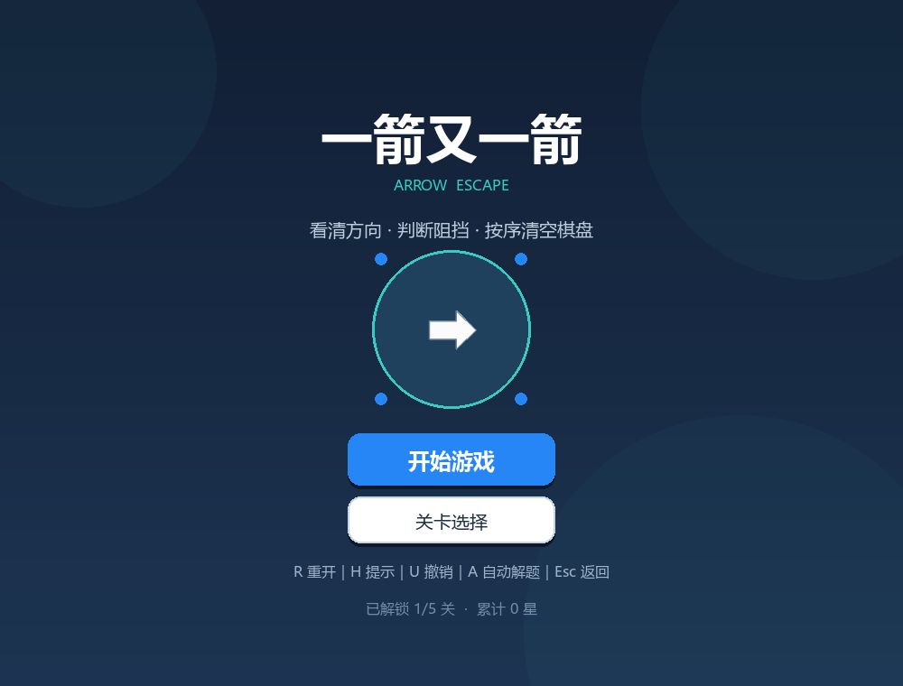
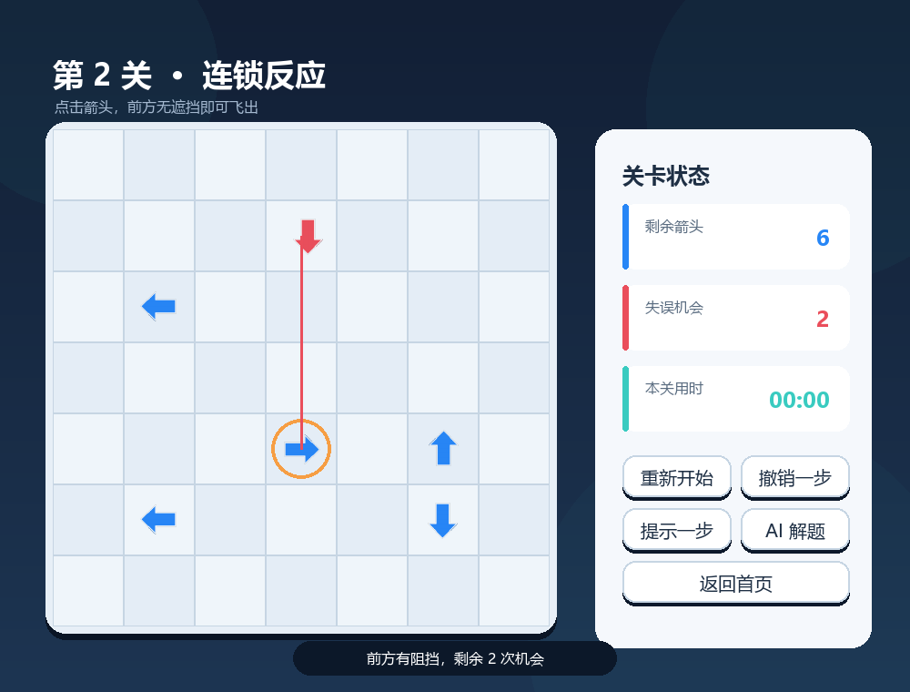
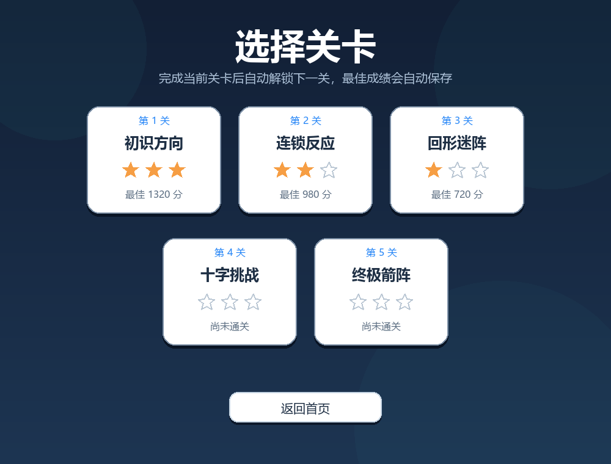
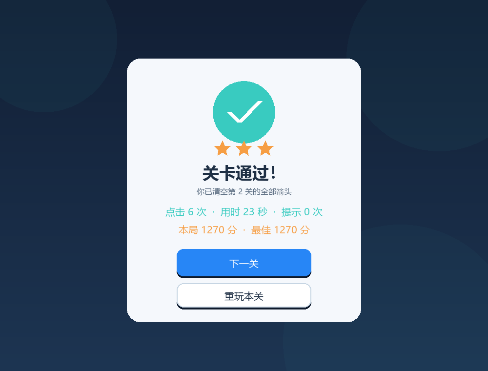
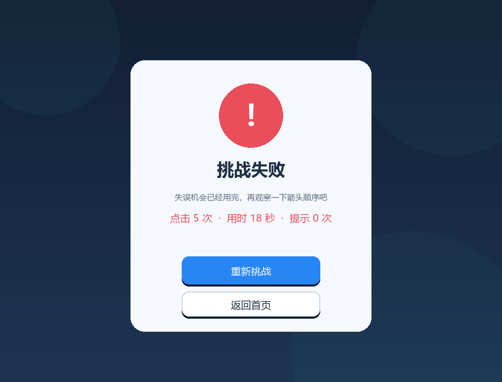

# 一箭又一箭（Arrow Escape）

一款使用 Python 与 Pygame 独立开发的点击式箭头解谜小游戏。玩家需要观察箭头朝向和同一行/列上的阻挡关系，按正确顺序点击箭头，将它们全部送出棋盘。

本项目不使用商业游戏的代码、素材或关卡；界面图形和 5 个关卡均为原创。

## 游戏截图

| 开始界面 | 游戏与碰撞反馈 |
| --- | --- |
|  |  |

### 关卡选择、解锁与最佳成绩



| 通关界面 | 失败界面 |
| --- | --- |
|  |  |

## 功能特点

- 完整的开始、关卡选择、游戏、关卡通过、失败和全部通关界面；
- 上、下、左、右四种箭头，以及严格的同行/同列路径检测；
- 箭头飞出动画、碰撞晃动、路径连线、阻挡高亮和文字提示；
- 失误机会、剩余箭头、当前关卡和用时显示；
- 5 个原创关卡，全部由内置求解器自动验证可通关；
- 关卡逐步解锁、1～3 星评价、得分和每关最佳成绩；
- JSON 自动保存解锁进度、星级、最佳分数和最快时间；
- 提示一步、撤销操作，以及带动画的 AI 自动解题演示；
- 核心规则与界面分离，包含 24 项自动化测试。

## 开发环境

- 操作系统：Windows 10/11（代码也可运行于支持 Pygame 的 macOS/Linux）
- Python：3.10 及以上；本项目已在 Python 3.13.9 验证
- Pygame：2.6.1

## 安装与运行

在项目根目录打开 PowerShell 或终端：

```powershell
python -m venv .venv
.\.venv\Scripts\Activate.ps1
python -m pip install -r requirements.txt
python main.py
```

如果系统限制 PowerShell 脚本，可跳过激活步骤，直接运行：

```powershell
.\.venv\Scripts\python.exe -m pip install -r requirements.txt
.\.venv\Scripts\python.exe main.py
```

## 操作说明

- 鼠标左键：点击箭头或按钮；
- 前方无遮挡：箭头飞出棋盘并消失；
- 前方有箭头：发生碰撞，箭头晃动并扣除 1 次失误机会；
- `R`：重新开始当前关卡；
- `H`：高亮一个当前可安全飞出的箭头；
- `U`：撤销上一步，恢复箭头、失误机会和计时；
- `A`：开始或停止 AI 自动解题演示；
- `Esc`：返回开始界面（在开始界面按下则退出）；
- `Enter` / `Space`：开始游戏或在结果页继续。

## 路径判断方法

每个箭头用 `(row, col, direction)` 表示。点击后，从箭头相邻格开始，沿方向增量逐格检查：

```python
dr, dc = arrow.direction.delta
row, col = arrow.row + dr, arrow.col + dc
while self.in_bounds(row, col):
    if (row, col) in self.arrows:
        return self.arrows[(row, col)]
    row += dr
    col += dc
return None
```

只有当前进方向到棋盘边界之间没有其他箭头时，箭头才会被移除。规则代码位于 `arrow_game/core.py`，界面代码位于 `arrow_game/app.py`。

## 自动测试

运行全部测试：

```powershell
python -m unittest discover -v
```

当前共 24 项测试，覆盖畅通、阻挡、四个边界方向、通关、失败、重开、撤销、自动求解、评分、JSON 存档、字体兼容、关卡可解性和界面状态流。项目最终验证结果为 `OK`，详见 [TEST_REPORT.md](TEST_REPORT.md)。

重新生成 README 截图：

```powershell
python main.py --capture-screenshots docs/screenshots
```

## 项目结构

```text
.
├── arrow_game/
│   ├── app.py              # Pygame 界面、交互和动画
│   ├── core.py             # 棋盘模型、路径检测和求解器
│   ├── levels.py           # 5 个原创关卡
│   └── progress.py         # 星级、得分、进度与 JSON 存档
├── docs/screenshots/       # 实际运行界面截图
├── tests/                  # 规则测试和界面流程测试
├── AIGC_LOG.md             # 真实 AIGC 协作过程记录
├── BLOG.md                 # 可发布的课程博客正文
├── TEST_REPORT.md          # 测试过程与结果
├── main.py                 # 程序入口
└── requirements.txt        # 运行依赖
```

## AIGC 使用说明

本项目使用 OpenAI Codex 辅助需求拆分、路径检测实现、关卡求解验证、Pygame 界面编写和测试。开发过程中发现并修复了死锁关卡、字体符号缺失等问题，过程记录见 [AIGC_LOG.md](AIGC_LOG.md)。代码已通过实际运行、截图渲染和自动化测试。

## 存档说明

首次运行后，程序会在项目根目录生成 `save_data.json`。该文件只保存关卡解锁、星级、最佳分数和最快时间，不包含账号或敏感信息，且已加入 `.gitignore`，不会上传到 GitHub。删除该文件即可重置进度。

## 素材与版权

所有箭头、按钮、棋盘和背景均由 Pygame 基础绘图 API 实时绘制，没有下载或使用第三方图片、音效，也没有使用原商业游戏的素材与关卡。
