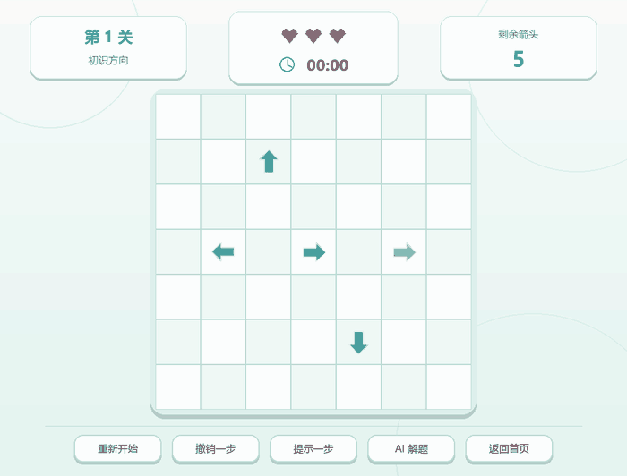

# 一箭又一箭

这是我用 Python 和 Pygame 完成的一款点击式箭头解谜小游戏。箭头只能沿自身方向飞行；如果前方还有其他箭头，就会发生碰撞并扣除一次失误机会。把棋盘上的箭头全部清空即可过关。


## 动态演示

| 箭头正常飞出 | 碰撞与失误反馈 |
| --- | --- |
|  |  |

其余开始、提示与撤销、自动解题、失败重开动画见 [docs/blog-assets](docs/blog-assets)。

## 已完成功能

- 上、下、左、右四种单格箭头和同行、同列路径判断
- 开始、关卡选择、游戏、通关、失败和全部通关界面
- 飞出动画、碰撞晃动、阻挡高亮和文字提示
- 5 个原创关卡，均通过求解器验证可通关
- 关卡解锁、星级、得分、计时和最佳成绩
- 提示、撤销和 AI 自动解题演示
- JSON 本地存档

## 运行方法

推荐使用 Python 3.10 或更高版本。本项目开发时使用 Python 3.13.9 和 Pygame 2.6.1。

```powershell
python -m venv .venv
.\.venv\Scripts\Activate.ps1
python -m pip install -r requirements.txt
python main.py
```

如果不想创建虚拟环境，也可以直接安装依赖后运行：

```powershell
python -m pip install -r requirements.txt
python main.py
```

## 操作

| 操作 | 说明 |
| --- | --- |
| 鼠标左键 | 点击箭头或按钮 |
| `R` | 重新开始当前关卡 |
| `H` | 提示一步 |
| `U` | 撤销上一步 |
| `A` | 开始或停止自动解题 |
| `Esc` | 返回首页；在首页退出 |

## 测试

```powershell
python -m unittest discover -v
```

目前共有 24 项测试，覆盖路径判断、边界、通关、失败、重开、撤销、求解器、评分和存档。5 个关卡也会在测试中逐一验证是否可解。

如需重新生成文档截图：

```powershell
python main.py --capture-screenshots docs/blog-assets
```

重新生成博客功能演示 GIF：

```powershell
python main.py --capture-gifs docs/blog-assets
```

## 目录

```text
arrow_game/          游戏代码
tests/               自动化测试
docs/
  blog-assets/       博客截图和功能 GIF
  blog.md             课程博客正文
  development-log.md  开发与 AIGC 使用记录
  test-report.md      测试记录
main.py               程序入口
requirements.txt      依赖列表
```

更多内容：

- [课程博客正文](docs/blog.md)
- [开发记录](docs/development-log.md)
- [测试报告](docs/test-report.md)

## 说明

界面中的箭头、吉祥物、爱心、按钮和背景纹理由 Pygame 实时绘制。版式参考了同类休闲游戏的常见设计，但没有使用商业游戏的代码、素材、音效或关卡。

游戏进度保存在根目录的 `save_data.json` 中。该文件已加入 `.gitignore`；删除它可以重置进度。
