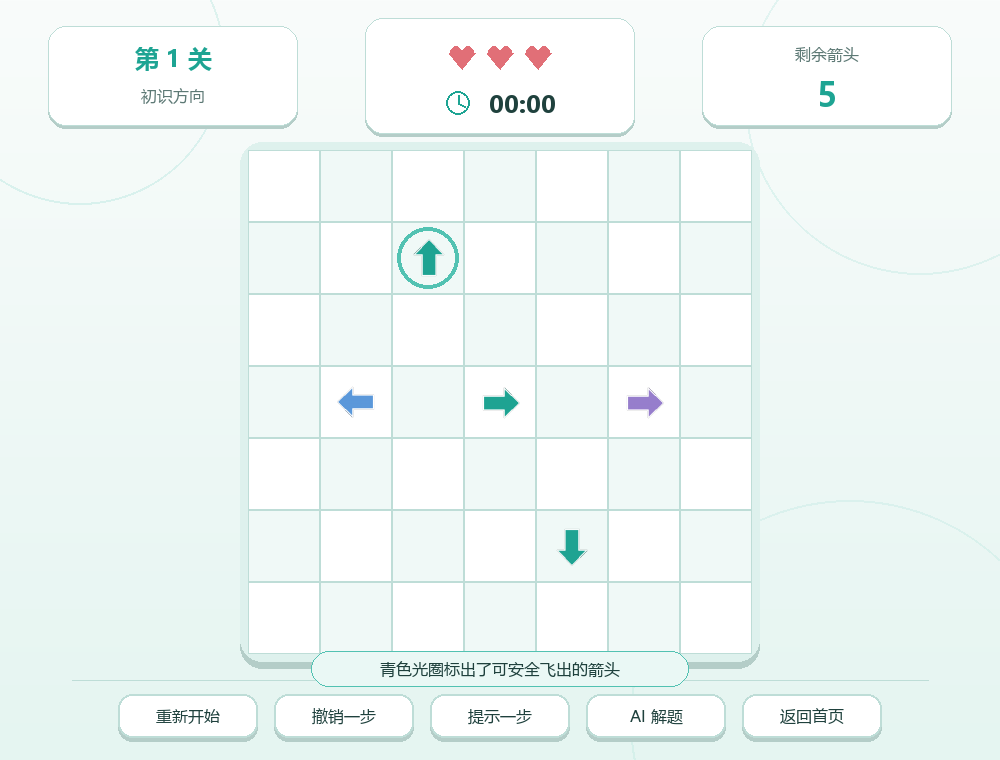
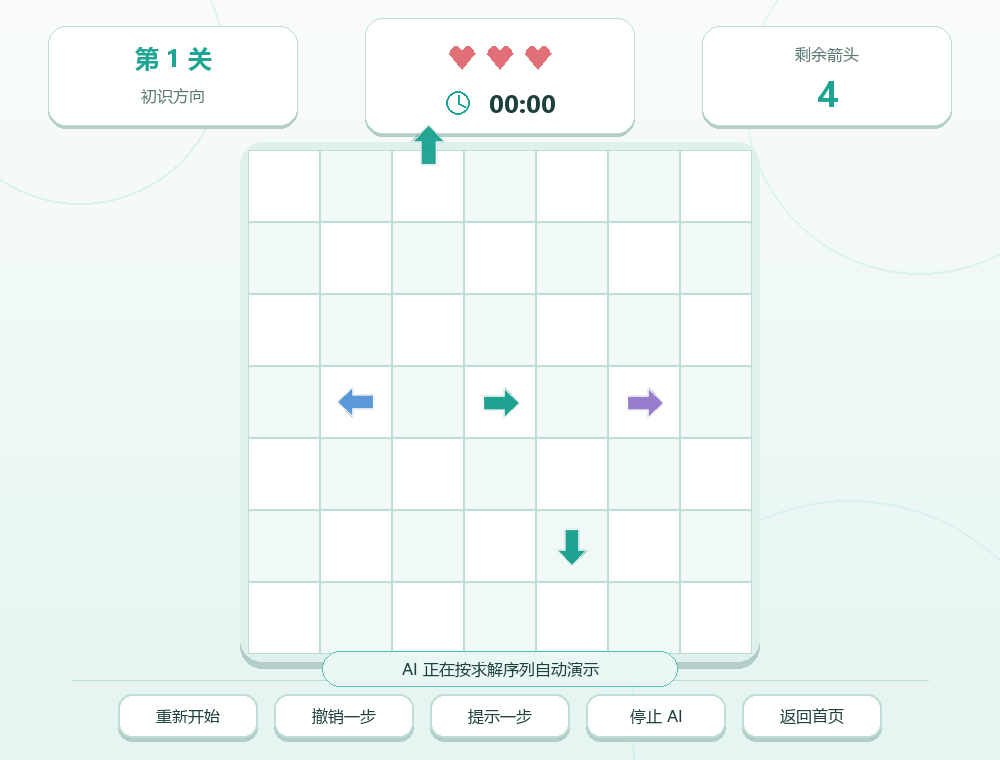
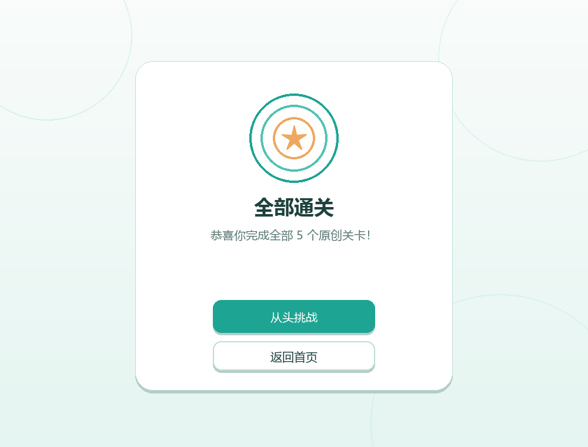

# 第一次用 Pygame 做小游戏：一箭又一箭开发记录

| 项目内容 | 内容 |
| --- | --- |
| 这个作业属于哪个课程 | [2026 春软件工程与软件工程实践](https://edu.cnblogs.com/campus/fzu/2026-01SoftwareEngineeringandSoftwareEngineeringPractice/) |
| 这个作业要求在哪里 | [个人作业——使用 AIGC 完成小游戏开发](https://edu.cnblogs.com/campus/fzu/2026-01SoftwareEngineeringandSoftwareEngineeringPractice/homework/16718) |
| 这个作业的目标 | 使用 Python 和 AIGC 完成“一箭又一箭”小游戏 |
| 学号 | 102401514 |
| GitHub 仓库 | [Sqarxx/arrow-escape-pygame](https://github.com/Sqarxx/arrow-escape-pygame) |

## 一、项目展示

这次作业我使用 Python 和 Pygame 做了一个点击式箭头解谜游戏。玩家需要判断箭头前方是否有其他箭头，按照合适的顺序把棋盘清空。

开始界面使用了浅青绿色背景和简单的箭头图案，整体没有继续采用最开始的深色界面。


游戏内包含关卡、剩余箭头、失误机会和用时等信息。青绿色表示正常状态，点击错误时会使用淡红色做碰撞提示。


除了基础的重新开始，我还加入了提示、撤销和自动演示功能。提示只显示当前一步，自动演示会按照可行顺序完成当前关卡。

| 提示功能 | 自动演示 |
| --- | --- |
|  |  |

本关箭头清空后会显示通关面板；失误机会用完则进入失败界面，两种情况都可以继续操作。

| 通关界面 | 失败界面 |
| --- | --- |
|  |  |

五关全部完成后会显示总通关结果。



关卡选择界面会记录已经解锁的关卡和每关取得的星级。


## 二、游戏规则和主要功能

棋盘中的每个箭头只占一个网格，方向分为上、下、左、右四种。点击箭头后，程序沿它指向的行或列检查：

- 前方没有其他箭头时，箭头飞出棋盘并消失；
- 前方存在箭头时，本次点击失败，箭头晃动并变成淡红色，同时扣除一次失误机会；
- 清空棋盘后通过本关；
- 失误次数变为 0 后本关失败，可以重新开始。

项目目前共有 5 个固定关卡。基础要求之外，我实现了以下功能：

- 关卡选择和逐关解锁；
- 计时、步数和星级评价；
- 提示下一步；
- 撤销上一步；
- 自动演示当前关卡；
- 本地保存解锁进度和最佳成绩；
- 一键生成课程博客所需的界面截图。

这些附加功能都建立在基础玩法已经完成的前提下，没有修改“同一行或同一列检测阻挡”的判定规则。

## 三、实现思路

### 1. 项目结构

我没有把全部内容写进一个文件，而是把数据、界面、核心逻辑和测试分开：

```text
arrow-escape-pygame/
├─ main.py                 程序入口
├─ arrow_game/
│  ├─ app.py               界面、事件处理和动画
│  ├─ core.py              路径检测、游戏状态和求解器
│  ├─ levels.py            关卡数据
│  └─ progress.py          本地进度、评分和存档
├─ tests/                  自动化测试
└─ docs/                   博客、开发记录、测试报告和截图
```

这样做的好处是测试路径判断时不需要启动窗口，界面代码也不会和关卡数据混在一起。

### 2. 箭头和关卡的表示

每个箭头保存行、列和方向。关卡由一组 `Arrow` 对象组成，方向使用 `Direction` 枚举表示。

```python
(
    Arrow(1, 2, Direction.UP),
    Arrow(3, 1, Direction.LEFT),
    Arrow(3, 3, Direction.RIGHT),
)
```

创建棋盘时，程序用 `(row, col)` 作为字典的键保存箭头。这样既方便绘制，也能快速判断某个格子上是否存在箭头。

### 3. 路径检测

路径检测是本项目最关键的部分。点击一个箭头后，先根据方向得到行列变化量，再从箭头前方一格开始向边界移动。如果途中遇到还没有消除的箭头，就说明路径被挡住；如果一直走出边界，则可以飞出。

核心逻辑可以简化成下面这样：

```python
dr, dc = arrow.direction.delta
row, col = arrow.row + dr, arrow.col + dc

while 0 <= row < rows and 0 <= col < cols:
    if (row, col) in arrows:
        return False
    row += dr
    col += dc

return True
```

这个方法统一处理了四种方向，没有为上、下、左、右分别写四套相似代码。边缘箭头的前方坐标会直接超出循环范围，因此也不会访问不存在的数组下标。

### 4. 飞出与碰撞反馈

可以消除时，箭头会先从棋盘逻辑状态中移除，同时创建一个保留其外观的飞行动画对象。画面上的箭头沿当前方向移动到棋盘外后，动画对象才会被清理。

发生碰撞时，箭头会短暂左右晃动并变成淡红色，顶部的失误次数同步减少。这样玩家能够看清是哪一次点击出了问题，不会只看到数字突然变化。

### 5. 关卡可解性

固定关卡并不是只看起来像关卡就可以。我写了一个回溯求解器：每一步找出所有可以飞出的箭头，逐个尝试，直到棋盘为空。如果搜索不到完整顺序，就说明布局存在死局。

提示功能只取求解结果中的第一步；自动演示则按求解顺序逐步点击。五个关卡也都加入了自动化测试，防止后来调整关卡时不小心引入无法通关的布局。

### 6. 保存进度

程序会把已解锁关卡和每关最好成绩保存在本地 `save_data.json` 中。这个文件属于运行后产生的数据，已经写入 `.gitignore`，不会把个人游玩记录提交到仓库。如果文件不存在，游戏会自动从第一关开始创建默认进度。

## 四、AIGC 使用过程

这次开发主要使用 Codex 辅助分析、编写和检查代码。我没有直接把一次生成的结果当作最终版本，而是运行程序、查看报错，再根据实际效果继续修改。下面记录几次比较有代表性的过程。

| 子任务 | 使用工具 | 我提出的要求 | AI 提供的内容 | 实际效果和人工修改 |
| --- | --- | --- | --- | --- |
| 路径检测 | Codex | 用同一套逻辑处理四个方向，并避免边缘越界 | 给出方向增量和逐格扫描的实现，同时补充单元测试 | 基本逻辑正确；我又增加了相邻阻挡、隔空阻挡和边缘朝外等情况进行验证 |
| 关卡设计 | Codex | 生成多个包含四种方向的可玩关卡 | 提供关卡数组和回溯求解思路 | 初版有两个布局无法解完，我根据求解结果调整了三个箭头方向，最后用测试逐关验证 |
| 中文字体报错 | Codex | 根据 `pygame.font.SysFont` 的报错定位启动失败原因 | 判断候选字体参数传递方式不兼容，并建议直接加载系统字体文件 | 改为按存在顺序加载微软雅黑、黑体等字体文件；找不到时再回退到默认字体，程序可以正常启动 |
| 界面调整 | Codex | 把深色界面改成浅青绿色，并参考给出的封面布局 | 调整颜色、卡片层级、背景箭头和顶部状态栏 | 初版有按钮文字重叠，我实际运行后重新调整字号、间距和窗口比例；所有图形均由 Pygame 绘制，没有使用参考游戏素材 |
| 提示与自动求解 | Codex | 在基础规则不变的情况下加入提示、撤销和自动演示 | 根据求解器结果实现三个功能，并补充状态恢复逻辑 | 我限制了提示和自动演示的使用次数，同时规定使用自动演示最多获得一星，避免附加功能完全替代玩家操作 |

这几次协作中，AIGC 最有用的地方是快速给出代码骨架和测试方向，但是否能运行、关卡是否可解、界面是否舒服，还是需要我自己实际检查。完整的开发记录放在仓库的 `docs/development-log.md` 中。

## 五、测试过程与结果

### 1. 自动化测试

测试命令如下：

```bash
python -m unittest discover -q
```

当前共运行 24 项测试，结果为：

```text
Ran 24 tests
OK
```

测试不仅覆盖路径判断，也包含关卡可解性、撤销、失败状态、提示、存档和异常存档恢复。

### 2. 作业要求中的六项测试

| 编号 | 测试内容 | 预期结果 | 实际结果 | 是否通过 |
| --- | --- | --- | --- | --- |
| T01 | 点击前方无阻挡的箭头 | 箭头飞出棋盘并消失 | 播放飞出动画后箭头数量减 1 | 通过 |
| T02 | 点击前方有阻挡的箭头 | 箭头不消失，失误次数减 1 | 箭头晃动并变为淡红色，机会减 1 | 通过 |
| T03 | 点击边缘且朝向棋盘外的箭头 | 正常消失，不发生越界错误 | 箭头正常飞出，程序无异常 | 通过 |
| T04 | 消除本关全部箭头 | 显示通关并进入下一关 | 显示星级和用时，可进入下一关 | 通过 |
| T05 | 失误次数耗尽 | 显示失败并允许重新开始 | 出现失败面板，重新开始后状态恢复 | 通过 |
| T06 | 游戏进行中重新开始 | 布局和失误次数恢复 | 箭头、计时、步数和机会均恢复初始值 | 通过 |

我还手工检查了开始界面、关卡选择、提示、撤销、自动演示、最后一关完成和关闭后重新读取进度等流程。更详细的测试说明见仓库中的 `docs/test-report.md`。

## 六、GitHub 开发过程

我按功能拆分提交，没有在最后一次性上传。部分提交记录如下：

```text
feat: 实现路径检测和可解关卡数据
feat: 完成游戏界面、动画和状态流程
fix: 兼容Windows系统字体加载
feat: 增加提示撤销和自动求解
style: 改为青绿色浅色极简主题
style: 重构封面与游戏HUD布局
docs: 补齐博客所需的八张界面截图
```

仓库中只保存源代码、测试、说明文档和截图，没有上传密码、Cookie、API Key 等信息。运行生成的存档、缓存和日志也已经通过 `.gitignore` 排除。

## 七、PSP 表格

| 任务 | 预估耗时（小时） | 实际耗时（小时） | 差异（小时） |
| --- | ---: | ---: | ---: |
| 需求分析与游戏设计 | 0.8 | 0.7 | -0.1 |
| Python 与 Pygame 学习 | 1.0 | 0.8 | -0.2 |
| 游戏界面实现 | 2.0 | 3.0 | +1.0 |
| 路径与碰撞逻辑实现 | 1.5 | 1.2 | -0.3 |
| 关卡设计 | 1.0 | 1.2 | +0.2 |
| AIGC 辅助开发 | 0.8 | 1.0 | +0.2 |
| 附加功能实现 | 1.5 | 2.0 | +0.5 |
| 测试与修改 | 1.2 | 1.8 | +0.6 |
| README 与博客撰写 | 1.2 | 1.5 | +0.3 |
| 合计 | 11.0 | 13.2 | +2.2 |

实际花费比预估多的部分主要在界面和测试。界面不是把颜色换掉就结束了，字体、按钮间距和动画速度都需要反复运行才能看出问题。测试耗时增加则主要是因为加入了存档、撤销和自动求解后，需要确认这些功能不会破坏原来的游戏状态。

## 八、心得体会

开始做这个项目时，我觉得规则很简单：只要看箭头前面有没有东西。但真正写成程序后，边界处理、动画期间能否继续点击、失败后如何恢复、撤销时保存哪些状态，都会影响游戏是否稳定。

这次我比较明显的收获是把界面和核心规则分开。路径判断放在独立模块后，不启动 Pygame 窗口也可以测试，修改界面时也不容易碰坏规则。回溯求解器原本只是为了做提示，后来也用来检查关卡是否真的能够通关，这比只靠手工试玩更可靠。

AIGC 确实提高了开发速度，尤其适合生成重复代码、列出测试边界和一起分析报错。不过它给出的关卡不一定可解，界面尺寸也不一定适合实际窗口。如果没有自己运行和理解代码，很容易留下表面上完整、实际上无法使用的问题。因此我把 AI 当成协作和检查工具，最终结果仍以实际运行、测试和自己的修改为准。

项目地址：[https://github.com/Sqarxx/arrow-escape-pygame](https://github.com/Sqarxx/arrow-escape-pygame)
